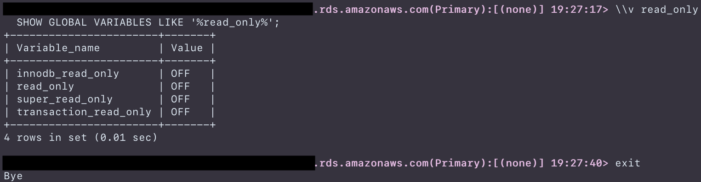
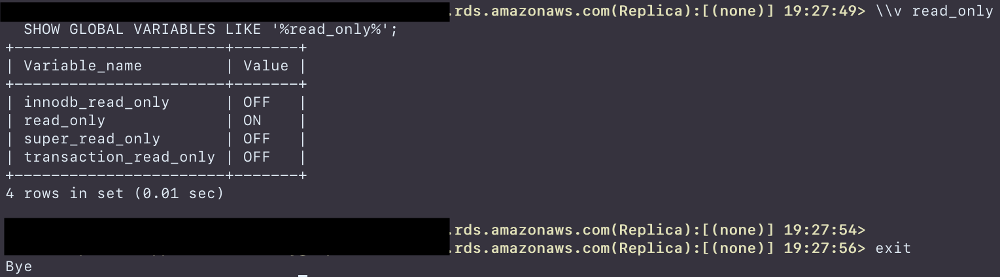

## MySQL Custom Command Line Interface
### CLI 프롬프트
#### 서버 정보 식별
```
[mysql]
prompt="\\u@\\X(\\Z):[\\d] \\R:\\m:\\s>"
```
* `\\X` Proxy mode로 접속시, 로컬 디스크의 파일에서 서버 호스트 정보 가져와서 표시
	* 지정된 디렉토리(아래 2개)에 `port_host_map.list` 파일 준비 필요
		* `~/.mysqlrc/` 기본 디렉토리
		* `MYSQL_SCRIPTDIR` 환경 변수에 설정된 디렉토리
	* `port_host_map.list` 파일은 호스트당 1 라인씩, `port_no hostname` 쌍으로 작성 (space로 분리)
	* `port_host_map.list` 파일에서 해당 port를 찾지 못하면, `\\h`와 동일하게 작동
	* Aurora MySQL 서버의 경우, `port_host_map.list` 파일 참조 없이 자동 인식됨 (서버 쿼리 이용)
```
99901   myhost-0.com
99902   myhost-1.com
```

* `\\Y` MySQL 서버의 Replication role 표시
	* Origianl MySQL & Non-Aurora RDS
		* `SHOW SLAVE STATUS` 결과가 있으면, `Replica`로 인식
		* 결과가 없으면, `Primary`로 인식
	* Aurora MySQL 서버의 경우, `information_schema.replica_host_status` 테이블 참고하여 `Primary | Replica` 인식 

#### 컬러
```
[mysql]
prompt_color_primary=magenta
prompt_color_replica=yellow
```
* `prompt_color_primary` Primary 서버의 prompt 컬러 설정

* `prompt_color_replica` Replica 서버의 prompt 컬러 설정

* 설정 가능 컬러 : `black | red | green | yellow | blue | magenta | cyan | white`

---------------------

### SQL 스크립트 실행
MySQL client에서 `source` 명령을 사용하면, 파일로 저장된 SQL 문장을 실행할 수 있다. 하지만 `source` 명령은 정적인 SQL 또는 세션 변수만 사용할 수 있는데, 세션 변수는 다음과 같은 단점이 있다.
* 사용자가 SQL 문장의 세션 변수를 알고 있어야 함
* 세션 변수의 값을 설정하는 작업은 상대적으로 번거로움
* SQL 문장의 특정 위치에는 세션 변수 사용 불가함

이런 불편함을 최소화하기 위해서, `\\x script_file_name` 명령으로 파일의 SQL을 실행할 수 있도록 기능을 추가했다. 아래와 같은 SQL을 가진 파일을 생성해두면,
```
$ cat ~/.mysqlrc/test.sql
SELECT '#{STRING_VARIABLE}' as string_var 
LIMIT #{LIMIT_N_ROWS};
```
`\\x` 명령으로 준비된 파일의 SQL을 실행할 수 있다.
```
mysql> \\x test
  > parameter #{STRING_VARIABLE}: test message
  > parameter #{LIMIT_N_ROWS}: 10
SELECT 'test message' as string_var 
LIMIT 10;
+--------------+
| string_var   |
+--------------+
| test message |
+--------------+
```
`\\x` 명령 사용시
* SQL이 저장된 스크립트 파일의 확장자는 `.sql` 이어야 함
* `\\x` 명령 사용시 `.sql`은 생략하고 파일의 이름만 명시해야 함
* SQL 파일은 아래 2개 디렉토리에 존재해야 함
 		1. `MYSQL_SCRIPTDIR` 환경 변수에 설정된 디렉토리
		2. `~/.mysqlrc/` 기본 디렉토리

디렉토리 설정 주의 사항
`MYSQL_SCRIPTDIR` 환경 변수가 설정되지 않은 경우에만, `~/.mysqlrc` 디렉토리가 사용됨

---------------------

### 단축 명령어 (MySQL CLI 내장 SQL)
단축 명령어는 미리 설정된 SQL을 짧은 입력만으로 원하는 SELECT 쿼리를 실행할 수 있도록 해준다. 단축 명령어는 MySQL client 프롬프트에서 `\\`로 시작하는 1~2글자의 알파벳으로 구성되어 있으며, 단축 명령이 실행한 SQL 문장을 화면에 표시하고, (필요한 경우 parameter 입력 후) 즉시 실행한다.

#### 단축 명령어 도움말 보기
프롬프트에서 `\\` 를 입력하면, 지원되는 단축 명령어를 확인할 수 있다.
```
mysql> \\
ERROR:
Unknown command

>> Usage ::
   =========================================================
     u               : SHOW USERs
     u [name]        : SHOW CREATE USER (name)
     d               : SHOW DATABASEs
     d [name]        : SHOW CREATE DATABASE (name)
     t               : SHOW TABLEs
     t [name]        : SHOW CREATE TABLE (name)
     f               : SHOW all FUNCTIONs
     f [name]        : SHOW CREATE FUNCTION (name)
     p               : SHOW all PROCEDUREs
     p [name]        : SHOW CREATE PROCEDURE (name)
     tg              : SHOW all TRIGGERs
     tg [name]       : SHOW CREATE TRIGGER (name)
     ps              : SHOW PROCESSLIST
     ps+             : SHOW FULL PROCESSLIST
     rm (or rp)      : SHOW MASTER STATUS
     rs (or rr)      : SHOW REPLICA STATUS
     v               : SHOW GLOBAL VARIABLEs
     v [name]        : SHOW GLOBAL VARIABLEs LIKE '%name%'
     lw(or ll or l+) : Lock waiting list
     tx              : Long transaction list (over N seconds)
     fs              : List all data file size
     fs [name]       : Data file size
     ts              : List all tablespace size (index_length + data_length)
     ts [name]       : Tablespace size (index_length + data_length)
   =========================================================
```

#### 사용자 목록 보기 (`\\u`)
```
mysql> \\u
  SELECT user, host, account_locked, plugin as auth_plugin FROM mysql.user;
+------------------+-----------+----------------+-----------------------+
| user             | host      | account_locked | auth_plugin           |
+------------------+-----------+----------------+-----------------------+
| mysql.infoschema | localhost | Y              | caching_sha2_password |
| mysql.session    | localhost | Y              | caching_sha2_password |
| mysql.sys        | localhost | Y              | caching_sha2_password |
| user             | localhost | N              | mysql_native_password |
+------------------+-----------+----------------+-----------------------+
```

#### 사용자 상세 정보 보기 (`\\u user@host`)
```
mysql> \\u `user`@`localhost`
  SHOW CREATE USER `user`@`localhost`;
  SHOW GRANTS FOR `user`@`localhost`;
+-----------------------------------------------------------------------...+
| CREATE USER for user@localhost                                        ...|
+-----------------------------------------------------------------------...+
| CREATE USER `user`@`localhost` IDENTIFIED WITH 'mysql_native_password'...|
+-----------------------------------------------------------------------...+

+-----------------------------------------------------------------------...+
| Grants for user@localhost                                             ...|
+-----------------------------------------------------------------------...+
| GRANT SELECT, INSERT, UPDATE, DELETE, CREATE, DROP, RELOAD, SHUTDOWN, ...|
| GRANT APPLICATION_PASSWORD_ADMIN,AUDIT_ABORT_EXEMPT,AUDIT_ADMIN,AUTHEN...|
| GRANT PROXY ON ``@`` TO `user`@`localhost` WITH GRANT OPTION          ...|
+-----------------------------------------------------------------------...+
```

#### 데이터베이스 목록 보기 (`\\d`)
```
mysql> \\d
  SHOW DATABASES;
+--------------------+
| Database           |
+--------------------+
| information_schema |
| mysql              |
| performance_schema |
| sys                |
+--------------------+
```

#### 테이블 목록 보기 (`\\t`)
```
mysql> \\t
  SHOW TABLES;
+------------------+
| Tables_in_test   |
+------------------+
| abc              |
| def              |
+------------------+
```

#### 테이블 정보 보기 (`\\t table_name`)
```
mysql> \\t covering
  SHOW CREATE TABLE covering;
  SHOW TABLE STATUS LIKE 'covering';
*************************** 1. row ***************************
       Table: covering
Create Table: CREATE TABLE `covering` (
  `id` int NOT NULL AUTO_INCREMENT,
  `fd1` int DEFAULT NULL,
  `fd2` int DEFAULT NULL,
  `fd3` int DEFAULT NULL,
  `fd4` int DEFAULT NULL,
  PRIMARY KEY (`id`),
  KEY `ix_fd1_fd2_fd3_fd4` (`fd1`,`fd2`,`fd3`,`fd4`),
  KEY `ix_fd1_fd2_fd3` (`fd1`,`fd2`,`fd3`)
) ENGINE=InnoDB AUTO_INCREMENT=16 DEFAULT CHARSET=utf8mb4 COLLATE=utf8mb4_0900_ai_ci


*************************** 1. row ***************************
           Name: covering
         Engine: InnoDB
        Version: 10
     Row_format: Dynamic
           Rows: 15
 Avg_row_length: 1092
    Data_length: 16384
Max_data_length: 0
   Index_length: 16384
      Data_free: 0
 Auto_increment: 16
    Create_time: 2021-11-11 16:34:38
    Update_time: 2021-11-11 16:33:21
     Check_time: NULL
      Collation: utf8mb4_0900_ai_ci
       Checksum: NULL
 Create_options:
        Comment:
```

#### 스토어드 루틴(함수) 목록 보기 (`\\f`)
```
mysql> \\f
  SELECT ROUTINE_SCHEMA, ROUTINE_NAME, ROUTINE_TYPE, IS_DETERMINISTIC, EXTERNAL_LANGUAGE
  FROM information_schema.ROUTINES
  WHERE ROUTINE_SCHEMA NOT IN ('sys', 'information_schema', 'mysql', 'performance_schema')
    AND ROUTINE_TYPE='FUNCTION'
  ORDER BY ROUTINE_SCHEMA, ROUTINE_TYPE, ROUTINE_NAME;
+----------------+---------------+--------------+------------------+-------------------+
| ROUTINE_SCHEMA | ROUTINE_NAME  | ROUTINE_TYPE | IS_DETERMINISTIC | EXTERNAL_LANGUAGE |
+----------------+---------------+--------------+------------------+-------------------+
| test           | CustomerLevel | FUNCTION     | YES              | SQL               |
+----------------+---------------+--------------+------------------+-------------------+
```


#### 스토어드 루틴(함수) 내용 보기 (`\\f function_name`)
```
mysql> \\f CustomerLevel
  SHOW CREATE FUNCTION CustomerLevel;
*************************** 1. row ***************************
            Function: CustomerLevel
            sql_mode: STRICT_TRANS_TABLES,NO_ZERO_IN_DATE,NO_ZERO_DATE,ERROR_FOR_DIVISION_BY_ZERO,NO_ENGINE_SUBSTITUTION
     Create Function: CREATE DEFINER=`root`@`localhost` FUNCTION `CustomerLevel`(p_creditLimit double) RETURNS varchar(10) CHARSET utf8mb4
    DETERMINISTIC
BEGIN
    DECLARE lvl varchar(10);

    IF p_creditLimit > 50000 THEN
        SET lvl = 'PLATINUM';
    ELSEIF (p_creditLimit <= 50000 AND p_creditLimit >= 10000) THEN
        SET lvl = 'GOLD';
    ELSEIF p_creditLimit < 10000 THEN
        SET lvl = 'SILVER';
    END IF;

 RETURN (lvl);
END
character_set_client: utf8mb4
collation_connection: utf8mb4_0900_ai_ci
  Database Collation: utf8mb4_0900_ai_ci
```

#### 스토어드 루틴(프로시져) 목록 보기 (`\\p`)
```
mysql> \\p
  SELECT ROUTINE_SCHEMA, ROUTINE_NAME, ROUTINE_TYPE, IS_DETERMINISTIC, EXTERNAL_LANGUAGE
  FROM information_schema.ROUTINES
  WHERE ROUTINE_SCHEMA NOT IN ('sys', 'information_schema', 'mysql', 'performance_schema')
    AND ROUTINE_TYPE='PROCEDURE'
  ORDER BY ROUTINE_SCHEMA, ROUTINE_TYPE, ROUTINE_NAME;
+----------------+---------------+--------------+------------------+-------------------+
| ROUTINE_SCHEMA | ROUTINE_NAME  | ROUTINE_TYPE | IS_DETERMINISTIC | EXTERNAL_LANGUAGE |
+----------------+---------------+--------------+------------------+-------------------+
| test           | account_count | PROCEDURE    | NO               | SQL               |
| test           | citycount     | PROCEDURE    | NO               | SQL               |
+----------------+---------------+--------------+------------------+-------------------+
```

#### 스토어드 루틴(프로시져) 내용 보기 (`\\p procedure_name`)
```
mysql> \\p citycount
  SHOW CREATE PROCEDURE citycount;
*************************** 1. row ***************************
           Procedure: citycount
            sql_mode: STRICT_TRANS_TABLES,NO_ZERO_IN_DATE,NO_ZERO_DATE,ERROR_FOR_DIVISION_BY_ZERO,NO_ENGINE_SUBSTITUTION
    Create Procedure: CREATE DEFINER=`root`@`localhost` PROCEDURE `citycount`(IN country CHAR(3), OUT cities INT)
BEGIN
         SELECT COUNT(*) INTO cities FROM world.city
         WHERE CountryCode = country;
       END
character_set_client: utf8mb4
collation_connection: utf8mb4_0900_ai_ci
  Database Collation: utf8mb4_0900_ai_ci
```

#### 트리거 목록 보기 (`\\tg`)
```
mysql> \\tg
  SELECT TRIGGER_SCHEMA, TRIGGER_NAME, EVENT_MANIPULATION, EVENT_OBJECT_SCHEMA, EVENT_OBJECT_TABLE
  FROM information_schema.TRIGGERS
  WHERE TRIGGER_SCHEMA NOT IN ('sys', 'information_schema', 'mysql', 'performance_schema')
  ORDER BY TRIGGER_SCHEMA, TRIGGER_NAME;
+----------------+--------------+--------------------+---------------------+--------------------+
| TRIGGER_SCHEMA | TRIGGER_NAME | EVENT_MANIPULATION | EVENT_OBJECT_SCHEMA | EVENT_OBJECT_TABLE |
+----------------+--------------+--------------------+---------------------+--------------------+
| test           | ins_sum      | INSERT             | test                | account            |
+----------------+--------------+--------------------+---------------------+--------------------+
```

#### 트리거 내용 보기 (`\\tg trigger_name`)
```
mysql> \\tg ins_sum
  SHOW CREATE TRIGGER ins_sum;
*************************** 1. row ***************************
               Trigger: ins_sum
              sql_mode: STRICT_TRANS_TABLES,NO_ZERO_IN_DATE,NO_ZERO_DATE,ERROR_FOR_DIVISION_BY_ZERO,NO_ENGINE_SUBSTITUTION
SQL Original Statement: CREATE DEFINER=`root`@`localhost` TRIGGER `ins_sum` BEFORE INSERT ON `account` FOR EACH ROW SET @sum = @sum + NEW.amount
  character_set_client: utf8mb4
  collation_connection: utf8mb4_0900_ai_ci
    Database Collation: utf8mb4_0900_ai_ci
               Created: 2021-11-15 11:06:33.79
```

#### 프로세스 목록 보기 (`\\ps` or `\\ps+`)
```
mysql> \\ps
  SHOW PROCESSLIST;
+----+-----------------+-----------+------+---------+--------+------------------------+------------------+
| Id | User            | Host      | db   | Command | Time   | State                  | Info             |
+----+-----------------+-----------+------+---------+--------+------------------------+------------------+
|  5 | event_scheduler | localhost | NULL | Daemon  | 580379 | Waiting on empty queue | NULL             |
| 48 | root            | localhost | test | Sleep   |  60794 |                        | NULL             |
| 52 | root            | localhost | test | Query   |      0 | init                   | SHOW PROCESSLIST |
+----+-----------------+-----------+------+---------+--------+------------------------+------------------+
3 rows in set (0.00 sec)

mysql> \\ps+
  SHOW FULL PROCESSLIST;
+----+-----------------+-----------+------+---------+--------+------------------------+-----------------------+
| Id | User            | Host      | db   | Command | Time   | State                  | Info                  |
+----+-----------------+-----------+------+---------+--------+------------------------+-----------------------+
|  5 | event_scheduler | localhost | NULL | Daemon  | 580382 | Waiting on empty queue | NULL                  |
| 48 | root            | localhost | test | Sleep   |  60797 |                        | NULL                  |
| 52 | root            | localhost | test | Query   |      0 | init                   | SHOW FULL PROCESSLIST |
+----+-----------------+-----------+------+---------+--------+------------------------+-----------------------+
```

#### 레플리케이션 프라이머리 정보 보기 (`\\rp` or `\\rm`)
```
mysql> \\rp
  SHOW MASTER STATUS;
*************************** 1. row ***************************
             File: mysql-bin-changelog.027332
         Position: 27831251
     Binlog_Do_DB:
 Binlog_Ignore_DB:
Executed_Gtid_Set:
```

#### 레플리케이션 레플리카 정보 보기 (`\\rr` or `\\rs`)
```
mysql> \\rs
  SHOW REPLICA STATUS;
*************************** 1. row ***************************
             Replica_IO_State: Waiting for master to send event
                  Source_Host: 192.168.0.0
                  Source_User: rdsrepladmin
                  Source_Port: 3306
                Connect_Retry: 60
              Source_Log_File: mysql-bin-changelog.027332
          Read_Source_Log_Pos: 47136784
               Relay_Log_File: relaylog.081857
                Relay_Log_Pos: 47049846
        Relay_Source_Log_File: mysql-bin-changelog.027332
           Replica_IO_Running: Yes
          Replica_SQL_Running: Yes
              Replicate_Do_DB:
          Replicate_Ignore_DB:
           Replicate_Do_Table:
                          ...
```

#### 시스템 변수 보기 (`\\v` or `\\v variable_name`)
```
mysql> \\v
  SHOW GLOBAL VARIABLES;
+------------------------------+-------+
| Variable_name                | Value |
+------------------------------+-------+
| activate_all_roles_on_login  | OFF   |
| admin_address                |       |
| admin_port                   | 3306  |

mysql> \\v innodb_io
  SHOW GLOBAL VARIABLES LIKE '%innodb_io%';
+------------------------+-------+
| Variable_name          | Value |
+------------------------+-------+
| innodb_io_capacity     | 200   |
| innodb_io_capacity_max | 2000  |
+------------------------+-------+
```

#### 잠금 대기 보기 (`\\lw` or `\\ll`)
```mysql> \\lw
  SELECT r.trx_wait_started AS wait_started,
    TIMEDIFF(NOW(), r.trx_wait_started) AS wait_age,
    TIMESTAMPDIFF(SECOND, r.trx_wait_started, NOW()) AS wait_age_secs,
    CONCAT(rl.object_schema, '.', rl.object_name) AS locked_table,
    ...
  FROM performance_schema.data_lock_waits w
    INNER JOIN information_schema.innodb_trx b  ON b.trx_id = CAST(w.blocking_engine_transaction_id AS CHAR)
    INNER JOIN information_schema.innodb_trx r  ON r.trx_id = CAST(w.requesting_engine_transaction_id AS CHAR)
    INNER JOIN performance_schema.data_locks bl ON bl.engine_lock_id = w.blocking_engine_lock_id
    INNER JOIN performance_schema.data_locks rl ON rl.engine_lock_id = w.requesting_engine_lock_id
  ORDER BY r.trx_wait_started;
+---------------------+----------+---------------+--------------+-----------------+-------------+----------------+...+
| wait_started        | wait_age | wait_age_secs | locked_table | locked_index    | locked_type | waiting_trx_id |...|
+---------------------+----------+---------------+--------------+-----------------+-------------+----------------+...+
| 2021-11-16 12:03:39 | 00:00:28 |            28 | test.json    | GEN_CLUST_INDEX | RECORD      |          59554 |...|
+---------------------+----------+---------------+--------------+-----------------+-------------+----------------+...+
```

#### 장시간 실행중인 트랜잭션 보기 (`\\tx`)
`THRESHOLD_SECONDS` 입력 값보다 오랜 시간동안 Active 상태인 트랜잭션의 목록 표시
```
mysql> \\tx
  > parameter #{THRESHOLD_SECONDS}: 50
  SELECT tx.trx_state, tx.trx_mysql_thread_id,
    (unix_timestamp(now()) - unix_timestamp(tx.trx_started)) as elapsed,
    IFNULL(th.processlist_command,'Unknown') as command,
    IFNULL(th.processlist_info, tx.trx_query) as last_query_of_trx,
    th.PROCESSLIST_ID, th.PROCESSLIST_USER, th.PROCESSLIST_HOST
  FROM information_schema.innodb_trx tx
    LEFT JOIN performance_schema.threads th ON th.processlist_id=tx.trx_mysql_thread_id
  WHERE tx.trx_state IN ('RUNNING', 'LOCK WAIT', 'ROLLING BACK', 'COMMITTING')
  AND (unix_timestamp(now()) - unix_timestamp(tx.trx_started))>=50;

+-----------+---------------------+---------+---------+-------------------+----------------+------------------+------------------+
| trx_state | trx_mysql_thread_id | elapsed | command | last_query_of_trx | PROCESSLIST_ID | PROCESSLIST_USER | PROCESSLIST_HOST |
+-----------+---------------------+---------+---------+-------------------+----------------+------------------+------------------+
| RUNNING   |                  53 |     130 | Sleep   | NULL              |             53 | root             | localhost        |
+-----------+---------------------+---------+---------+-------------------+----------------+------------------+------------------+
```

---------------------

### InnoDB adpative hash index 관련 경고
InnoDB adaptive hash index가 활성화된 경우, ALTER TABLE의 잠금 시간을 길게 만드는 문제점 있으며, 이에 대한 경고 문구임 (특히 DROP TABLE의 경우)
```
******************************************************************************
** WARNING                                                                  **
******************************************************************************
** Configured "innodb_adaptive_hash_index=ON"                               **
** Becareful when you run ALTER TABLE command                               **
******************************************************************************
```


